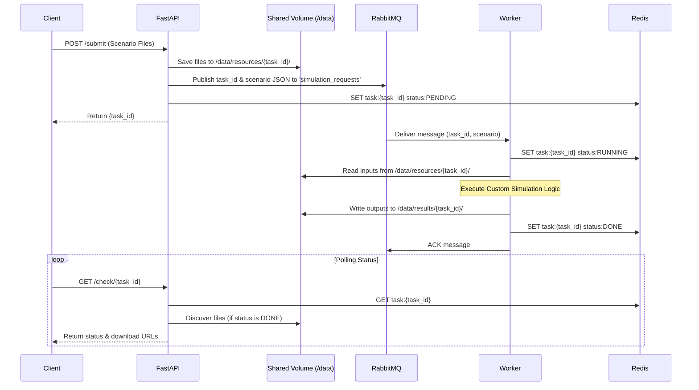

# Simulation Server (Generic Template)

A flexible, Docker-based architecture for running asynchronous simulation tasks via a web interface, message broker (RabbitMQ), and state cache (Redis).

This repository provides a generic template to dispatch simulation tasks to a queue of workers.

## Architecture

The system uses a microservice architecture built for scalability and generic simulation handling.

```mermaid
graph TD
    Client[Client (Web GUI / API)] -->|HTTP POST JSON/Files| FastAPI[FastAPI Web Service]
    FastAPI -->|Publish Task| RabbitMQ[(RabbitMQ Queue)]
    FastAPI -->|Set Status 'PENDING'| Redis[(Redis Cache)]
    
    RabbitMQ -->|Consume Task| Worker1[Worker 1 (Python)]
    RabbitMQ -->|Consume Task| WorkerN[Worker N]
    
    Worker1 -->|Read Inputs| InputVolume[Shared Volume: /data/resources]
    Worker1 -->|Set Status 'RUNNING'| Redis
    Worker1 -->|Write Outputs| OutputVolume[Shared Volume: /data/results]
    Worker1 -->|Set Status 'DONE'| Redis
    
    Client -->|HTTP GET Status| FastAPI
    FastAPI -->|Read Status| Redis
    FastAPI -->|Discover Output Files| OutputVolume
```

## Sequence Flow

The following sequence illustrates a typical end-to-end task execution:



## Prerequisites

- [Docker](https://docs.docker.com/get-docker/)
- [Docker Compose](https://docs.docker.com/compose/install/)

## Getting Started

1. **Clone the repository**
```bash
git clone https://github.com/NFDI4Energy/nfdi4energy-simulation-server
cd simulation-server
```

2. **Start the stack**
Run the following command to build the images and start the services (FastAPI, RabbitMQ, Redis, and a generic example worker):
```bash
docker-compose up -d --build
```

3. **Access the Web Interface**
Open `http://localhost:5001` in your browser. You can upload a scenario file (JSON) to queue a new task.

4. **Monitor the Worker**
Check the logs of the example worker to see it process the queue:
```bash
docker-compose logs -f example_worker
```

5. **Stop the stack**
```bash
docker-compose down
```

## Creating Custom Workers

To use your own simulation logic, modify or replace `task_queue/example_worker.py`. The fundamental requirements for a worker are:

1. **Listen to RabbitMQ**: Subscribe to the `simulation_requests` queue.
2. **Read Inputs**: Access user-uploaded files from `RESOURCES_DIR/{task_id}/`.
3. **Execute**: Run your computationally heavy task, model execution, or custom code.
4. **Write Outputs**: Save the resulting data/reports to `RESULTS_DIR/{task_id}/`.
5. **Update State**: Update the `Redis` status token (`task:{task_id}`) to `DONE` and acknowledge the RabbitMQ message.

The FastAPI web service will automatically detect any new files saved to `RESULTS_DIR /{task_id}/` and serve them as downloadable links to the client.

## License

This project is licensed under the MIT License - see the LICENSE file for details.
