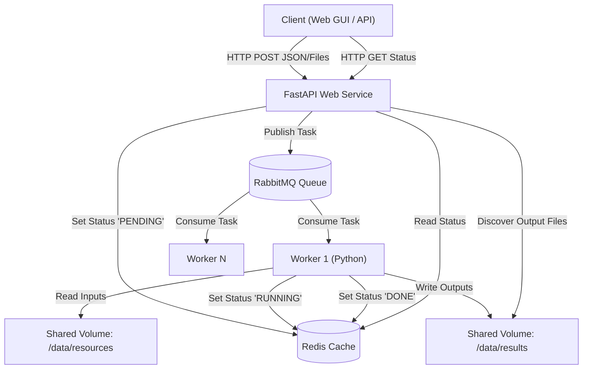
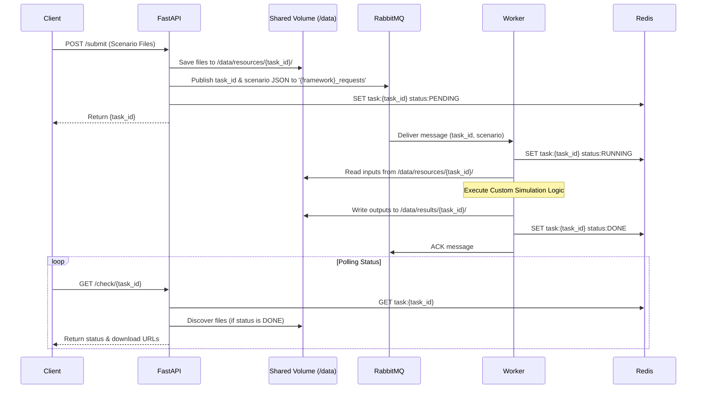

# Simulation Server (Generic Template)

A flexible, Docker-based architecture for running asynchronous simulation tasks via a web interface, message broker (RabbitMQ), and state cache (Redis).

This repository provides a generic template to dispatch simulation tasks to a queue of workers.

## Architecture

The system uses a microservice architecture built for scalability and generic simulation handling.


```mermaid
graph TD
    Client["Client (Web GUI / API)"] -->|HTTP POST JSON/Files| FastAPI[FastAPI Web Service]
    FastAPI -->|"Publish Task"| RabbitMQ[(RabbitMQ Queue)]
    FastAPI -->|"Set Status 'PENDING'"| Redis[(Redis Cache)]
    
    RabbitMQ -->|"Consume Task"| Worker1["Worker 1 (Python)"]
    RabbitMQ -->|"Consume Task"| WorkerN["Worker N"]
    
    Worker1 -->|"Read Inputs"| InputVolume["Shared Volume: /data/resources"]
    Worker1 -->|"Set Status 'RUNNING'"| Redis
    Worker1 -->|"Write Outputs"| OutputVolume["Shared Volume: /data/results"]
    Worker1 -->|"Set Status 'DONE'"| Redis
    
    Client -->|"HTTP GET Status"| FastAPI
    FastAPI -->|"Read Status"| Redis
    FastAPI -->|"Discover Output Files"| OutputVolume
```

## Sequence Flow

The following sequence illustrates a typical end-to-end task execution:


```mermaid
sequenceDiagram
    participant Client
    participant FastAPI
    participant SharedVolume as Shared Volume (/data)
    participant RabbitMQ
    participant Worker
    participant Redis

    Client->>FastAPI: POST /submit (Scenario Files)
    FastAPI->>SharedVolume: Save files to /data/resources/{task_id}/
    FastAPI->>RabbitMQ: Publish task_id & scenario JSON to '{framework}_requests'
    FastAPI->>Redis: SET task:{task_id} status:PENDING
    FastAPI-->>Client: Return {task_id}

    RabbitMQ->>Worker: Deliver message (task_id, scenario)
    Worker->>Redis: SET task:{task_id} status:RUNNING
    Worker->>SharedVolume: Read inputs from /data/resources/{task_id}/
    
    Note over Worker: Execute Custom Simulation Logic

    Worker->>SharedVolume: Write outputs to /data/results/{task_id}/
    Worker->>Redis: SET task:{task_id} status:DONE
    Worker->>RabbitMQ: ACK message

    loop Polling Status
        Client->>FastAPI: GET /check/{task_id}
        FastAPI->>Redis: GET task:{task_id}
        FastAPI->>SharedVolume: Discover files (if status is DONE)
        FastAPI-->>Client: Return status & download URLs
    end
```

## Prerequisites

- [Docker](https://docs.docker.com/get-docker/)
- [Docker Compose](https://docs.docker.com/compose/install/)

## Getting Started

1. **Clone the repository**
```bash
git clone https://github.com/NFDI4Energy/nfdi4energy-simulation-server
cd simulation-server
```

2. **Start the stack**
Run the following command to build the images and start the services (FastAPI, RabbitMQ, Redis, and a generic example worker):
```bash
docker-compose up -d --build
```

3. **Access the Web Interface**
Open `http://localhost:5001` in your browser. You can upload a scenario file (JSON) to queue a new task.

4. **Monitor the Worker**
Check the logs of the example worker to see it process the queue:
```bash
docker-compose logs -f example_worker
```

5. **Stop the stack**
```bash
docker-compose down
```

## Creating Custom Workers

To use your own simulation logic, modify or replace `task_queue/example_worker.py`. The fundamental requirements for a worker are:

1. **Listen to RabbitMQ**: Subscribe to the framework-specific queue (e.g., `dacedsx_requests`, `mosaik_requests`).
2. **Read Inputs**: Access user-uploaded files from `RESOURCES_DIR/{task_id}/`.
3. **Execute**: Run your computationally heavy task, model execution, or custom code.
4. **Write Outputs**: Save the resulting data/reports to `RESULTS_DIR/{task_id}/`.
5. **Update State**: Update the `Redis` status token (`task:{task_id}`) to `DONE` and acknowledge the RabbitMQ message.

The FastAPI web service will automatically detect any new files saved to `RESULTS_DIR /{task_id}/` and serve them as downloadable links to the client.

## Adding a New Framework

The server supports multiple simulation frameworks via a handler factory in `fastapi_app/rabbitmq_client.py`. Each framework is implemented as a subclass of `SimulationHandler`.

### Handler Structure

| Method | Purpose |
|---|---|
| `publish(task_id, scenario, queue)` | Publish the task message to the framework's RabbitMQ queue |
| `parse_scenario(files)` | Parse uploaded files into a scenario dict |
| `get_resources_dir(task_id)` | Return the directory where input files are stored |
| `get_redis_fields()` | Extra fields to store in Redis (must include `"framework"`) |

### Steps to Add a Framework

**1. Declare the queue** — in `SimulationQueue.__init__`:

```python
self.channel.queue_declare(queue="myframework_requests", durable=True)
```

**2. Create a handler** — subclass `SimulationHandler` in `rabbitmq_client.py`:

```python
class MyFrameworkSimulationHandler(SimulationHandler):
    @property
    def framework_name(self) -> str:
        return "myframework"
    # publish, parse_scenario, get_resources_dir, get_redis_fields inherited from parent
    # Override any of these if the default behavior doesn't fit.
```

**3. Register the handler** — in the `HANDLERS` dict:

```python
HANDLERS = {
    "dacedsx": DaceDSXSimulationHandler(),
    "mosaik": MosaikSimulationHandler(),
    "myframework": MyFrameworkSimulationHandler(),
}
```

No changes to `webapp.py` are needed — the endpoint dispatches entirely through `get_handler(framework)`.

**Usage:**

```
POST /submit?framework=myframework
```

### Worker Requirement

Each framework needs a corresponding worker that subscribes to its queue (e.g., `myframework_requests`) and reads input files from the directory returned by `get_resources_dir(task_id)`.

## License

This project is licensed under the MIT License - see the LICENSE file for details.
